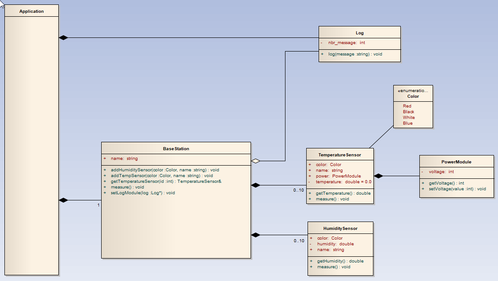

# POO Labo 1

## But

Le but de ce laboratoire est de prendre en main les bases de la notion objet.

## Diagramme



## Description

Vous allez devoir implémenter les classes qui sont représentées sur ce diagramme.

## Important
- Les classes doivent être déclarées dans les headers `.h`
- Respecter les accès depuis le diagramme
- Toutes les variables doivent être initialisées
  - Constructeur ou déclaration

#### Application
Représente la fonction `main`

#### BaseStation
- Tableau de `TemperatureSensor` et de `HumiditySensor`
- `add...` : Permet d'ajouter un capteur à la liste. Il faut donc une variable qui nous permet de connaître le nombre d'éléments. On doit contrôler la capacité du tableau.
- On définit le nombre max d'éléments avec une `constante`
- `measure` : Il faut ajouter du code pour parcourir tout les 
capteurs de température et d'humidité est appeler pour chacun la
méthode `measure()`. Ne pas oublié au début de la méthode d'appeler
la méthode `log` du module `Log`. `log("Start measure")`
- Comme on le voit sur le diagramme, cette classe utilise le module `log`. Il faut donc avoir un lien sur cet objet dans la classe.
- `setLogModule` : Permet d'affecter le lien entre l'objet `log` et
la classe.
- Il faut un constructeur qui va initialiser les variables.

#### PowerModule
- Classe avec une seul propriété que l'on peut lire ou écrire
uniquement en utilisant les méthodes d'accès.
- Il faut un constructeur qui initialise la variable `volatage` à `0`

#### Color
- Dans le fichier `sensors.cpp` déclarer un `enum` avec les couleurs
- Créer aussi une fonction avec le prototype : `string colorToString(Color c)` qui vous permet de convertir la valeur `enum` en `string` 

### Execution
- Voici l'affichage attendu de la fonction `main`
 
 ```Console
 Labo 1
Log 1 : Start measure
Le capteur : Temp 1 mesure la température
Le capteur : Temp 2 mesure la température
Le capteur : Hum 1 mesure l'humidité
Log 2 : Start measure
Le capteur : Temp 1 mesure la température
Le capteur : Temp 2 mesure la température
Le capteur : Hum 1 mesure l'humidité
Name : Temp 1 / Color : red / Power voltage : 12
 ```
 
  ## Partie 2
 *Vous pouvez changer le nom des méthodes et propriétés proposées.*

 - Ajouter une classe `Sensor` qui est une classe parente pour les capteurs d'humidité et de température.
 - La propriété `name` doit se trouver dans la classe `Sensor`
 - La propriété `name` doit être `const`
 - Dans la classe `Sensor` ajouter une méthode `getName` qui permet de retourner une chaîne de caractère : `Le capteur : <name>`
 - La classe `Sensor` **ne doit pas** avoir de constructeur par défaut (sans paramètre). On doit au moins fournir le nom lors de la construction du `Sensor`.
 - Implémenter une méthode `measure` dans le capteur de température pour afficher :
 `la température du capteur <name> est : <temperature> °C`
 - Implémenter une méthode `measure` dans le capteur d'humidité pour afficher :
 `l'humidité du capteur <name> est : <humidity> °C`
 - Remplacer les tableaux de capteur dans la classe `BaseStation`, par **un** tableau de capteur générique avec des éléments `Sensor`.
 - Remplacer les méthodes pour ajouter un capteur, par une méthode qui permet d'ajouter un capteur générique de type `Sensor`
 - Pour ajouter un capteur, on doit obligatoirement donner un nom, mais la couleur est optionnelle. Par défaut on utilise la couleurs `noire`
 - Ajouter une méthode pour supprimer un `Sensor` 
 - Lorsque l'on appelle la méthode `measure` dans la classe `BaseStation`, il faut parcourir le tableau de capteur et appeler pour chacun la méthode `measure`
 - Ajouter une méthode dans `BaseStation` qui permet de récupérer une référence sur un capteur par rapport à sa position dans le tableau :
   - `Sensor& getSensor(index)`
   - Dans le main on doit pouvoir exécuter un code du genre :
     ```C
     Sensor& s = bs.getSensor(2);
     s.getName();
     s.measure();
     ```
- Ajouter une méthode `printSensorsList` dans `BaseStation` qui affiche la liste de tout les capteurs. (On doit appeler la méthode `getName`). Ajouter l'appelle de cette méthode dans le `main`

#### Réflexion
Dans la méthode `measure` de `BaseStation`, il faut que si c'est un capteur de température, on doit aussi appeler la méthode `log`. Comment implémenter cette fonctionnalité ?
